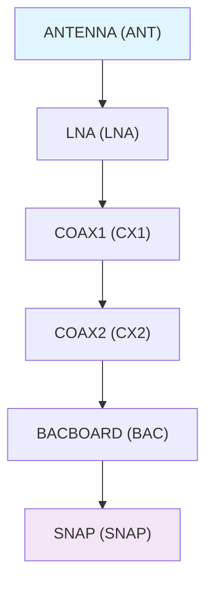

# CAsMan - CASM Assembly Manager

A comprehensive toolkit for managing and visualizing CASM (Coherent All-Sky Monitor) assembly processes. CAsMan provides CLI tools for part management, barcode generation, assembly tracking with connection validation, and interactive visualization.

## Key Features

- **🔧 Part Management**: Database-driven part tracking with validation
- **📊 Interactive Scanning**: Barcode scanning with real-time connection validation  
- **🔗 Connection Validation**: Enforces strict assembly chain rules and prevents invalid connections
- **📈 Visualization**: ASCII and web-based chain visualization with duplicate detection
- **🏷️ Barcode Generation**: Automated barcode creation for parts and printing pages
- **📋 Assembly Tracking**: Complete assembly history with timestamps

## Assembly Chain Validation

CAsMan enforces strict assembly chain rules to ensure proper CASM assembly:



### Connection Rules

- **🔒 Sequence Enforcement**: Parts must connect in order: `ANT → LNA → COAX1 → COAX2 → BACBOARD → SNAP`
- **🔒 Directionality**: ANTENNA parts can only be sources, SNAP parts can only be targets
- **🔒 No Duplicates**: Each part can have only one outgoing and one incoming connection
- **🔒 Part Validation**: All parts validated against database and SNAP mapping files

## Installation

### From Source with Virtual Environment (Recommended)

```bash
# Clone the repository
git clone https://github.com/Coherent-All-Sky-Monitor/CAsMan.git
cd CAsMan

# Create and activate a virtual environment
python -m venv .venv

# On macOS/Linux:
source .venv/bin/activate

# On Windows:
# .venv\Scripts\activate

# Install in development mode
pip install -e .

# Or install normally
pip install .
```

### With Development Dependencies

```bash
# After activating your virtual environment
pip install -e ".[dev]"
```

### Alternative: Direct Installation

```bash
# If you prefer not to use a virtual environment
pip install git+https://github.com/Coherent-All-Sky-Monitor/CAsMan.git
```

## Quick Start

**Note**: If you installed using a virtual environment, make sure to activate it before using CAsMan:
```bash
# On macOS/Linux:
source .venv/bin/activate

# On Windows:
# .venv\Scripts\activate
```

### Command Line Usage

```bash
# Main CLI interface with comprehensive help
casman --help

# List available commands
casman --list-commands

# Part management
casman parts list                    # List all parts in database
casman parts add                     # Interactive part addition (can add single type or all types)
casman parts search "ANT-P1"         # Search for specific parts

# Interactive scanning with connection validation
casman scan connection               # Interactive assembly scanning
casman scan stats                    # Assembly statistics

# Visualization with duplicate detection
casman visualize chains              # ASCII chain visualization  
casman visualize summary             # Summary statistics

# Barcode generation
casman barcode printpages --part-type ANTENNA --start-number 1 --end-number 50
```

### Enhanced Part Management

The `casman parts add` command provides flexible part creation options:

```bash
# Interactive part addition with type selection
casman parts add

# Example session options:
# 1: ANTENNA (alias: ANT)    - Add antenna parts
# 2: LNA (alias: LNA)        - Add LNA parts  
# 3: COAX1 (alias: CX1)      - Add COAX1 parts
# 4: COAX2 (alias: CX2)      - Add COAX2 parts
# 5: BACBOARD (alias: BAC)   - Add backboard parts
# 0: ALL (add parts for all types) - Add parts for all types at once

# Enter number of parts to create and polarization (1 or 2)
# Parts are automatically numbered and barcodes generated
```

### Enhanced Interactive Scanning

The `casman scan connection` command provides an interactive scanning experience with comprehensive validation:

- ✅ **Real-time part validation** against parts database
- ✅ **SNAP part validation** using snap_feng_map.yaml  
- ✅ **Connection sequence validation** (enforces ANT→LNA→COAX1→COAX2→BACBOARD→SNAP)
- ✅ **Duplicate prevention** (blocks multiple connections)
- ✅ **Chain directionality** (ANTENNA=sources only, SNAP=targets only)

```bash
# Start interactive scanning session
casman scan connection

# Example session:
# Scan first part: ANT-P1-00001
# ✅ Valid part: ANT-P1-00001 (ANTENNA, 1)
# Scan connected part: LNA-P1-00001  
# ✅ Valid part: LNA-P1-00001 (LNA, 1)
# ✅ Connection recorded: ANT-P1-00001 --> LNA-P1-00001
```

### Individual Tools

Each module can also be run independently:

```bash
# Part management
casman-parts

# Assembly scanning
casman-scan

# Visualization
casman-visualize

# Barcode generation
casman-barcode ANTENNA 1 50
```

## Package Structure

```
casman/
├── __init__.py           # Package initialization
├── cli.py               # Command-line interface entry point
├── cli/                 # CLI command modules
│   ├── __init__.py
│   ├── main.py         # Main CLI logic
│   ├── parts_commands.py
│   ├── assembly_commands.py
│   ├── barcode_commands.py
│   ├── visualization_commands.py
│   └── utils.py        # CLI utilities
├── assembly.py          # Assembly and scanning (legacy)
├── assembly/            # Assembly modules
│   ├── __init__.py
│   ├── chains.py       # Chain analysis and management
│   ├── connections.py  # Connection handling
│   ├── data.py         # Assembly data structures
│   └── interactive.py  # Interactive assembly tools
├── parts/               # Part management modules
│   ├── __init__.py
│   ├── db.py           # Database operations for parts
│   ├── generation.py   # Part number generation
│   ├── interactive.py  # Interactive part management
│   ├── part.py         # Part data structures
│   ├── search.py       # Part searching functionality
│   ├── types.py        # Part type definitions
│   └── validation.py   # Part validation
├── database/            # Database operations
│   ├── __init__.py
│   ├── connection.py   # Database connections
│   ├── initialization.py # Database setup
│   ├── migrations.py   # Database migrations
│   └── operations.py   # Database operations
├── visualization.py     # Visualization tools (legacy)
├── visualization/       # Visualization modules
│   ├── __init__.py
│   ├── core.py         # Core visualization functions
│   └── web.py          # Web visualization utilities
├── barcode_utils.py     # Barcode generation (legacy)
├── barcode/             # Barcode modules
│   ├── __init__.py
│   ├── generation.py   # Barcode generation
│   ├── operations.py   # Barcode operations
│   ├── printing.py     # Print page generation
│   └── validation.py   # Barcode validation
├── config.py            # Configuration handling (legacy)
└── config/              # Configuration modules
    ├── __init__.py
    ├── core.py         # Core configuration
    ├── environments.py # Environment management
    ├── schema.py       # Configuration schema
    └── utils.py        # Configuration utilities
```

## Configuration

CAsMan uses SQLite databases stored in the `database/` directory:

- `parts.db` - Part information and metadata
- `assembled_casm.db` - Assembly connections and scan history

Barcodes are generated in the `barcodes/` directory, organized by part type.

## Part Types

CAsMan supports multiple part types:

1. **ANTENNA** (ANT) - Antenna components
2. **LNA** (LNA) - Low Noise Amplifier components  
3. **COAX1** (CX1) - Coaxial cable components (first type)
4. **COAX2** (CX2) - Coaxial cable components (second type)
5. **BACBOARD** (BAC) - Backboard components
6. **SNAP** (SNAP) - SNAP components

Part numbers follow the format: `[ABBREVIATION]-P[POLARIZATION]-[NUMBER]` (e.g., `ANT-P1-00001`)

## Development

### Setting up Development Environment

```bash
# Clone and install in development mode
git clone https://github.com/Coherent-All-Sky-Monitor/CAsMan.git
cd CAsMan
pip install -e ".[dev]"

# Run tests
pytest

# Code formatting
black casman/

# Linting
flake8 casman/

# Type checking
mypy casman/
```

### Running the CLI in Development

```bash
# Run commands directly from source
python -m casman.cli --help
```

### Adding New Features

1. **New CLI Commands**: Add to `casman/cli/` modules and update main.py
2. **Database Changes**: Update modules in `casman/database/`
3. **New Part Types**: Update `PART_TYPES` in part type definitions

## Migration from Scripts

This package replaces the individual scripts in the `scripts/` directory:

| Old Script | New Command | New Module |
|------------|-------------|------------|
| `gen_add_part_numbers.py` | `casman parts add` | `casman.parts` |
| `read_parts_db.py` | `casman parts list` | `casman.parts` |
| `scan_and_assemble.py` | `casman scan connection` | `casman.assembly` |
| `visualize_analog_chains_term.py` | `casman visualize chains` | `casman.visualization` |
| `gen_barcode_printpages.py` | `casman barcode printpages` | `casman.barcode_utils` |

## Dependencies

### Core Dependencies

- **Pillow** - Image processing for barcode generation
- **python-barcode** - Barcode generation library

### Optional Dependencies

- **Flask** - Used by standalone web visualization scripts

### Development Dependencies

- **pytest** - Testing framework
- **black** - Code formatter
- **flake8** - Linting
- **mypy** - Type checking

## License

MIT License - see LICENSE file for details.

## Contributing

1. Fork the repository
2. Create a feature branch (`git checkout -b feature/new-feature`)
3. Make your changes
4. Add tests for new functionality
5. Run the test suite (`pytest`)
6. Format code (`black casman/`)
7. Commit your changes (`git commit -am 'Add new feature'`)
8. Push to the branch (`git push origin feature/new-feature`)
9. Create a Pull Request

## Support

For issues and questions:

- Create an issue on GitHub: https://github.com/Coherent-All-Sky-Monitor/CAsMan/issues
- Check the documentation in the repository

## Changelog

### Version 1.0.0

- Complete refactoring of script-based tools into installable package
- Comprehensive CLI with subcommands
- Improved database management with proper schemas
- Basic ASCII visualization functionality
- Comprehensive documentation and type hints
- Production-ready packaging with setup tools and project configuration

## Usage Examples

### List all parts
```sh
casman parts list
```

### Add new parts interactively
```sh
casman parts add                     # Choose specific part type or ALL types
```

### Generate barcodes for a part type
```sh
casman barcode printpages --part-type ANTENNA --start-number 1 --end-number 10
```

### Interactive assembly connection scanning
```sh
casman scan connection             # Start interactive assembly scanning with validation
```

### Visualize assembly chains in ASCII
```sh
casman visualize chains
```
