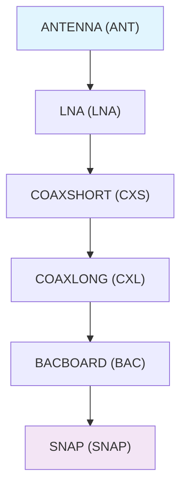

# CAsMan - CASM Assembly Manager

A comprehensive toolkit for managing and visualizing CASM (Coherent All-Sky Monitor) assembly processes. CAsMan provides CLI tools for part management, barcode generation, assembly tracking with connection validation, and interactive visualization.

## Assembly Chain Validation

CAsMan enforces strict assembly chain rules to ensure proper CASM assembly:


...

<pre class="mermaid">

graph TD
    A["ANTENNA (ANT)"]
    B["LNA (LNA)"]
    C["COAXSHORT (CXS)"]
    D["COAXLONG (CXL)"]
    E["BACBOARD (BAC)"]
    F["SNAP (SNAP)"]

    A --> B
    B --> C
    C --> D
    D --> E
    E --> F
    
    style A fill:#e1f5fe
    style F fill:#f3e5f5

</pre>

### Connection Rules

- **🔒 Sequence Enforcement**: Parts must connect in order: `ANT → LNA → COAXSHORT → COAXLONG → BACBOARD → SNAP`

- **🔒 Directionality**: ANTENNA parts can only be sources, SNAP parts can only be targets

- **🔒 No Duplicates**: Each part can have only one outgoing and one incoming connection

- **🔒 Part Validation**: All parts validated against database and SNAP mapping files

## Installation

### Quick Install Options

**Minimal install (Antenna module only - one line):**
```bash
pip install "git+https://github.com/Coherent-All-Sky-Monitor/CAsMan.git#egg=casman[antenna]"
```
- Perfect for data analysis, baseline calculations, UV coverage
- Only PyYAML dependency (~5MB vs ~50MB full install)
- No web interface, just Python API

**Full install (All features):**
```bash
pip install "git+https://github.com/Coherent-All-Sky-Monitor/CAsMan.git"
```

### From Source with Virtual Environment (Recommended for Development)

```bash

# Clone the repository
git clone https://github.com/Coherent-All-Sky-Monitor/CAsMan.git
cd CAsMan

# Create and activate a virtual environment
python -m venv .venv

# On macOS/Linux:
source .venv/bin/activate

# On Windows:

# .venv\Scripts\activate

# Install in development mode
pip install -e .

# Or install antenna module only
pip install -e ".[antenna]"

```

### With Development Dependencies

```bash

# After activating your virtual environment
pip install -e ".[dev]"

```

### Alternative: Direct Installation

```bash

# If you prefer not to use a virtual environment
pip install git+https://github.com/Coherent-All-Sky-Monitor/CAsMan.git

```

## Quick Start

**Note**: If you installed using a virtual environment, make sure to activate it before using CAsMan:

```bash

# On macOS/Linux:
source .venv/bin/activate

# On Windows:

# .venv\Scripts\activate

```

### Command Line Usage

```bash

# Main CLI interface with comprehensive help
casman --help

# List available commands
casman --list-commands

# Part management
casman parts list                    # List all parts in database
casman parts add                     # Interactive part addition (can add single type or all types)

# Interactive scanning with connection validation
casman scan connect                  # Full interactive scanning and assembly workflow
casman scan connection               # Basic connection scanning
casman scan disconnect               # Full interactive disconnection workflow
casman scan disconnection            # Basic disconnection scanning

# Database management
casman database clear                # Clear database contents with safety confirmations
casman database clear --parts        # Clear only parts database
casman database clear --assembled    # Clear only assembly database
casman database print               # Display formatted database contents

# Visualization with duplicate detection
casman visualize chains              # ASCII chain visualization

# Web interfaces
casman web                           # Launch unified web app (scanner + visualization)
casman web --mode prod               # Launch production server with Gunicorn
casman web --scanner-only            # Launch scanner interface only (port 5000)
casman web --visualize-only          # Launch visualization interface only (port 5000)

# Barcode generation
casman barcode printpages --part-type ANTENNA --start-number 1 --end-number 50

```

### Database Management

The `casman database` commands provide database operations:

```bash

# Clear database contents with double confirmation and visual warnings
casman database clear                # Clear both parts and assembly databases
casman database clear --parts        # Clear only the parts database
casman database clear --assembled    # Clear only the assembly database

casman database print               # Show assembly database in formatted tables
```

### Part Management

The `casman parts add` command provides flexible part creation options:

```bash

# Interactive part addition with type selection
casman parts add

# Example session options:

# 1: ANTENNA (alias: ANT)    - Add antenna parts

# 2: LNA (alias: LNA)        - Add LNA parts  

# 3: COAXSHORT (alias: CXS)      - Add COAXSHORT parts

# 4: COAXLONG (alias: CXL)      - Add COAXLONG parts

# 5: BACBOARD (alias: BAC)   - Add backboard parts

# 0: ALL (add parts for all types) - Add parts for all types at once

# Enter number of parts to create and polarization (1 or 2)

# Parts are automatically numbered and barcodes generated

```

### Enhanced Interactive Scanning

The `casman scan connect` command provides an interactive scanning experience:

- **Real-time part validation** against parts database

- **SNAP part validation** using format checks (SNAP<chassis><slot><port>)  

- **Connection sequence validation** (enforces ANT→LNA→COAXSHORT→COAXLONG→BACBOARD→SNAP)

- **Duplicate prevention** (blocks multiple connections)

- **Chain directionality** (ANTENNA=sources only, SNAP=targets only), can only scan connection in one direction.

```sh

# Start full interactive scanning and assembly workflow
casman scan connect

# Basic connection scanning (manual entry or barcode scanner)
casman scan connection

```

## Key Features

### Disconnect Tracking

Track part disconnections with full historical records. The database maintains both connection and disconnection events with automatic migration support.

**Usage:**
```bash
casman scan disconnect    # Record part disconnections
```

**Database Schema:**
- Automatic `connection_status` column migration
- Records marked as 'connected' or 'disconnected'
- Visualizations filter to show only connected parts
- Allows part reconnection after disconnection

**API:**
```python
from casman.assembly.connections import record_assembly_disconnection

# Record a disconnection
record_assembly_disconnection(
    part_number, part_type, polarization, scan_time,
    connected_to, connected_to_type, connected_polarization,
    connected_scan_time, db_dir=None
)
```

### Web Application

A web server serving both scanner and visualization interfaces with flexible configuration.

- Scanner interface for connecting/disconnecting parts
- Antenna grid position assignment workflow
- Visualization interface for viewing assembled chains
- Interactive 43×6 antenna grid display with SNAP port tracing
  
**Configuration (`config.yaml`):**
```yaml
web_app:
  enable_scanner: true
  enable_visualization: true
  dev:
    port: 5000
    host: "0.0.0.0"
  production:
    port: 8000
    workers: 4

# Antenna grid layout configuration (expandable format)
grid:
  core:
    array_id: "C"           # Core array identifier
    north_rows: 21          # Rows north of center (N001-N021)
    south_rows: 21          # Rows south of center (S001-S021)
    east_columns: 6         # East columns (E00-E05)
    allow_expansion: true   # Allow grid codes beyond core bounds
```

**Deployment:**
```bash
# Development mode
casman web

# Production mode with Gunicorn
casman web --mode prod

# Scanner-only for commissioning/repairs
casman web --scanner-only

# Visualization-only for monitoring
casman web --visualize-only
```

### Antenna Grid Position Assignment

CAsMan provides a complete system for assigning antennas to physical grid positions and tracing connections to SNAP boards.

**Grid Format:** `[A-Z][N/C/S][000-999]E[00-99]`

- **Array ID** (A-Z): Single letter identifying the array (C = core)
- **Direction** (N/C/S): North, Center, or South of array center
- **Offset** (000-999): Row offset (C must use 000, N/S must use 001-999)
- **East Column** (00-99): Zero-based east column index

**Examples:**
- `CN002E03` - Core array, North row 2, East column 3
- `CC000E01` - Core array, Center row, East column 1  
- `CS021E05` - Core array, South row 21, East column 5

**Scanner Workflow:**
1. Select "Assign Antenna Position" action
2. Choose input method (barcode scan or manual entry)
3. Enter antenna number (with or without P1/P2 suffix)
4. Select grid position using direction, offset, and column dropdowns
5. System validates antenna exists and checks position availability
6. Assign position with optional overwrite for corrections

**Visualization:**
- Visit `/visualize/grid` for interactive 43×6 grid display
- Search by antenna number or grid code
- View assigned positions with color highlighting
- Display SNAP port connections for both P1 and P2 polarizations
- Full analog chain tracing from antenna to SNAP board

**Database Schema:**
```sql
CREATE TABLE antenna_positions (
    antenna_number TEXT UNIQUE NOT NULL,  -- Base antenna (no P1/P2)
    array_id TEXT NOT NULL,                -- 'C' for core
    row_offset INTEGER NOT NULL,           -- -999 to +999 (signed)
    east_col INTEGER NOT NULL,             -- 0-99
    grid_code TEXT UNIQUE NOT NULL,        -- Canonical format
    assigned_at TEXT NOT NULL,             -- ISO timestamp
    notes TEXT
);
```

### Version Management

Automated version number management across all project files with git integration.

**Usage:**
```bash
# Show current version
python version_manager.py --show

# Increment version (patch/minor/major)
python version_manager.py --increment minor

# Set specific version
python version_manager.py --set 1.2.3

# Full release workflow
python version_manager.py --increment minor --commit --tag
```

**Files Updated:**
- `pyproject.toml` - Project version
- `casman/__init__.py` - Package version
- `casman/cli/utils.py` - CLI version display

**Semantic Versioning:**
- **MAJOR**: Breaking changes
- **MINOR**: New features (backward compatible)
- **PATCH**: Bug fixes and improvements

## Package Structure

```text

casman/
├── __init__.py           # Package initialization
├── cli.py               # Command-line interface entry point
├── cli/                 # CLI command modules
│   ├── __init__.py
│   ├── main.py         # Main CLI logic
│   ├── parts_commands.py
│   ├── assembly_commands.py
│   ├── barcode_commands.py
│   ├── visualization_commands.py
│   └── utils.py        # CLI utilities
├── assembly.py          # Assembly and scanning (legacy)
├── assembly/            # Assembly modules
│   ├── __init__.py
│   ├── chains.py       # Chain analysis and management
│   ├── connections.py  # Connection handling
│   ├── data.py         # Assembly data structures
│   └── interactive.py  # Interactive assembly tools
├── parts/               # Part management modules
│   ├── __init__.py
│   ├── db.py           # Database operations for parts
│   ├── generation.py   # Part number generation
│   ├── interactive.py  # Interactive part management
│   ├── part.py         # Part data structures
│   ├── search.py       # Part searching functionality
│   ├── types.py        # Part type definitions
│   └── validation.py   # Part validation
├── database/            # Database operations
│   ├── __init__.py
│   ├── connection.py   # Database connections
│   ├── initialization.py # Database setup
│   ├── migrations.py   # Database migrations
│   └── operations.py   # Database operations
├── visualization.py     # Visualization tools (legacy)
├── visualization/       # Visualization modules
│   ├── __init__.py
│   ├── core.py         # Core visualization functions
│   └── web.py          # Web visualization utilities
├── barcode_utils.py     # Barcode generation (legacy)
├── barcode/             # Barcode modules
│   ├── __init__.py
│   ├── generation.py   # Barcode generation
│   └── printing.py     # Print page generation
├── config.py            # Configuration handling (legacy)
└── config/              # Configuration modules
    ├── __init__.py
    ├── core.py         # Core configuration
    ├── environments.py # Environment management
    ├── schema.py       # Configuration schema
    └── utils.py        # Configuration utilities

```

## Configuration

CAsMan uses SQLite databases stored in the `database/` directory:

- `parts.db` - Part information and metadata

- `assembled_casm.db` - Assembly connections and scan history

Barcodes are generated in the `barcodes/` directory, organized by part type.

## Part Types

CAsMan supports multiple part types:

1. **ANTENNA** (ANT) - Antenna components
2. **LNA** (LNA) - Low Noise Amplifier components  
3. **COAXSHORT** (CXS) - Coaxial cable components (first type)
4. **COAXLONG** (CXL) - Coaxial cable components (second type)
5. **BACBOARD** (BAC) - Backboard components
6. **SNAP** (SNAP) - SNAP components

Part numbers follow the format: `[ABBREVIATION][NUMBER]P[POLARIZATION]` (e.g., `ANT00001P1`)

## Development

### Setting up Development Environment

```bash

# Clone and install in development mode
git clone https://github.com/Coherent-All-Sky-Monitor/CAsMan.git
cd CAsMan
pip install -e ".[dev]"

# Run tests
pytest

# Code formatting
black casman/

# Linting
flake8 casman/

# Type checking
mypy casman/

```

### Running the CLI in Development

```bash

# Run commands directly from source
python -m casman.cli --help

```

### Adding New Features

1. **New CLI Commands**: Add to `casman/cli/` modules and update main.py
2. **Database Changes**: Update modules in `casman/database/`
3. **New Part Types**: Update `PART_TYPES` in part type definitions

## Dependencies

### Core Dependencies

- **Pillow** - Image processing for barcode generation

- **python-barcode** - Barcode generation library

### Optional Dependencies

- **Flask** - Used by standalone web visualization scripts

### Development Dependencies

- **pytest** - Testing framework

- **coverage** - Code coverage analysis  

- **black** - Code formatter

- **flake8** - Linting

- **mypy** - Type checking

### Code Quality Tools

CAsMan includes automated tools for maintaining code quality:

```bash

# Quick coverage check with threshold validation
./coverage_check.sh

# Update README with latest coverage statistics
python3 update_coverage.py

# Git pre-commit hook (optional) - validates coverage before commits
bash .git/hooks/pre-commit

```

## License

MIT License - see LICENSE file for details.

## Contributing

1. Fork the repository
2. Create a feature branch (`git checkout -b feature/new-feature`)
3. Make your changes
4. Add tests for new functionality
5. Run the test suite (`pytest`)
6. Format code (`black casman/`)
7. Commit your changes (`git commit -am 'Add new feature'`)
8. Push to the branch (`git push origin feature/new-feature`)
9. Create a Pull Request

## Support

For issues and questions:

- Create an issue on [GitHub Issues](https://github.com/Coherent-All-Sky-Monitor/CAsMan/issues)

- Check the documentation in the repository


## Usage Examples

### List all parts

```sh

casman parts list

```

### Add new parts interactively

```sh

casman parts add                     # Choose specific part type or ALL types

```

### Generate barcodes for a part type

```sh

casman barcode printpages --part-type ANTENNA --start-number 1 --end-number 10

```

### Interactive assembly connection scanning

```sh

casman scan connect                # Full interactive scanning and assembly workflow

```

### Visualize assembly chains in ASCII

```sh

casman visualize chains

```

### Launch web interfaces

```sh

# Unified web application
casman web                           # Both scanner and visualization (dev mode, port 5000)
casman web --mode prod               # Production mode with Gunicorn (port 8000)
casman web --scanner-only            # Scanner interface only
casman web --visualize-only          # Visualization interface only
casman web --port 8080               # Custom port

```

### Manage grid position coordinates

```sh

# Load geographic coordinates from CSV
casman database load-coordinates                    # Load from database/grid_positions.csv
casman database load-coordinates --csv survey.csv   # Load from custom CSV file

```

CAsMan supports tracking latitude, longitude, and height for antenna grid positions. Coordinates are managed via CSV file for easy editing and version control. See [Grid Coordinates Documentation](docs/grid_coordinates.md) for details.

---

## Testing & Coverage

 


| Module | Coverage | Lines Covered |
|--------|----------|---------------|
| **__Init__** | 100.0% | 2/2 |
| **Antenna __Init__** | 100.0% | 4/4 |
| **Assembly __Init__** | 100.0% | 40/40 |
| **Assembly Connections** | 100.0% | 24/24 |
| **Assembly Data** | 100.0% | 15/15 |
| **Barcode __Init__** | 100.0% | 3/3 |
| **Cli __Init__** | 100.0% | 11/11 |
| **Database __Init__** | 100.0% | 5/5 |
| **Database Operations** | 100.0% | 31/31 |
| **Parts __Init__** | 100.0% | 10/10 |
| **Parts Db** | 100.0% | 4/4 |
| **Parts Search** | 100.0% | 65/65 |
| **Parts Types** | 100.0% | 11/11 |
| **Web __Init__** | 100.0% | 5/5 |
| **Assembly Chains** | 98.0% | 43/44 |
| **Parts Part** | 98.0% | 60/61 |
| **Visualization Core** | 97.0% | 106/109 |
| **Parts Validation** | 96.0% | 51/53 |
| **Visualization __Init__** | 95.0% | 18/19 |
| **Web App** | 95.0% | 37/39 |
| **Antenna Grid** | 93.0% | 94/101 |
| **Parts Interactive** | 92.0% | 111/121 |
| **Parts Generation** | 91.0% | 59/65 |
| **Barcode Generation** | 90.0% | 84/93 |
| **Database Antenna_Positions** | 90.0% | 145/161 |
| **Database Initialization** | 89.0% | 40/45 |
| **Cli Utils** | 88.0% | 28/32 |
| **Barcode Printing** | 86.0% | 90/105 |
| **Assembly Interactive** | 85.0% | 279/330 |
| **Config __Init__** | 85.0% | 22/26 |
| **Cli Web_Commands** | 80.0% | 44/55 |
| **Web Server** | 76.0% | 41/54 |
| **Cli Barcode_Commands** | 73.0% | 22/30 |
| **Cli Main** | 73.0% | 57/78 |
| **Antenna Array** | 71.0% | 101/143 |
| **Cli Database_Commands** | 69.0% | 131/189 |
| **Web Scanner** | 69.0% | 209/302 |
| **Cli Visualization_Commands** | 68.0% | 23/34 |
| **Cli Parts_Commands** | 66.0% | 51/77 |
| **Web Visualize** | 65.0% | 119/184 |
| **Database Connection** | 64.0% | 14/22 |
| **Cli Assembly_Commands** | 61.0% | 99/163 |
| **Antenna Chain** | 17.0% | 7/42 |
| **Overall** | **80.0%** | **2415/3007** |

### Running Tests

```bash

# Run all tests
pytest

# Run with coverage
coverage run -m pytest
coverage report --include="casman/*"

# Run specific test modules
pytest tests/test_parts.py -v
pytest tests/test_cli.py -v

# Quick coverage check script
./coverage_check.sh

```
